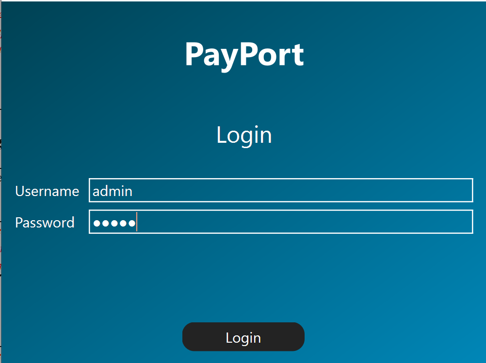
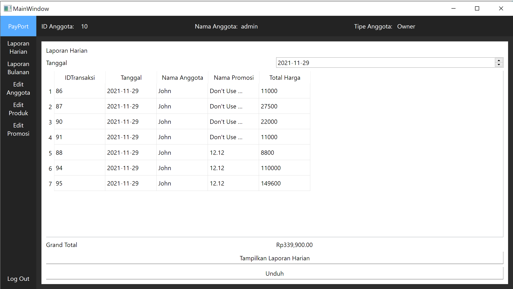
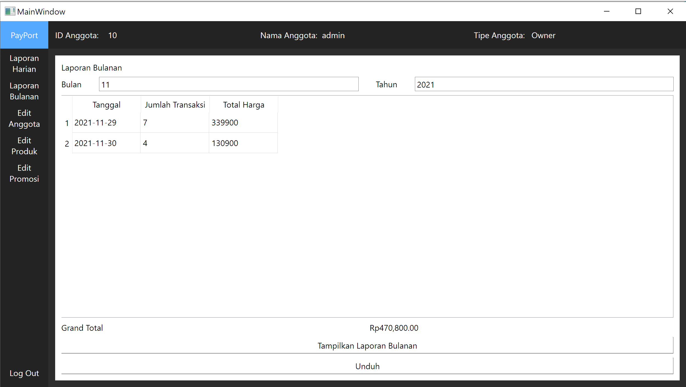
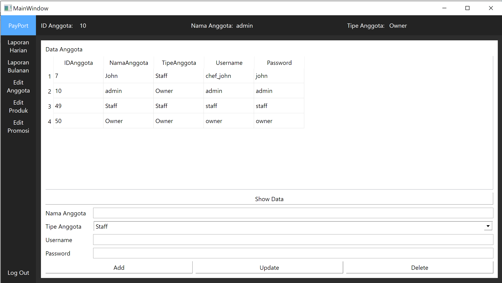
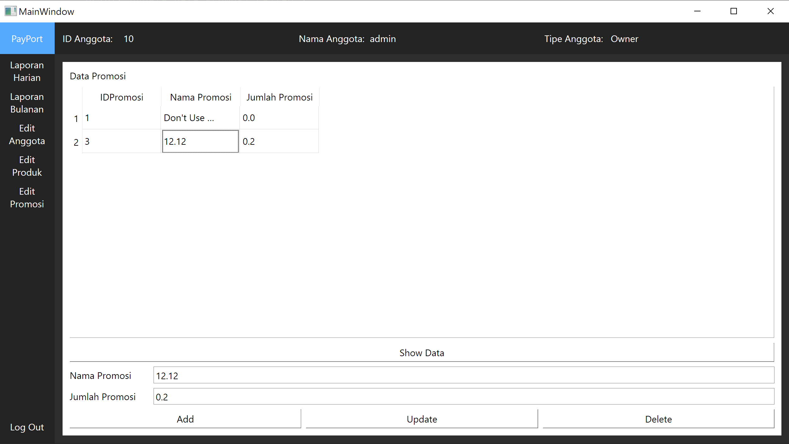
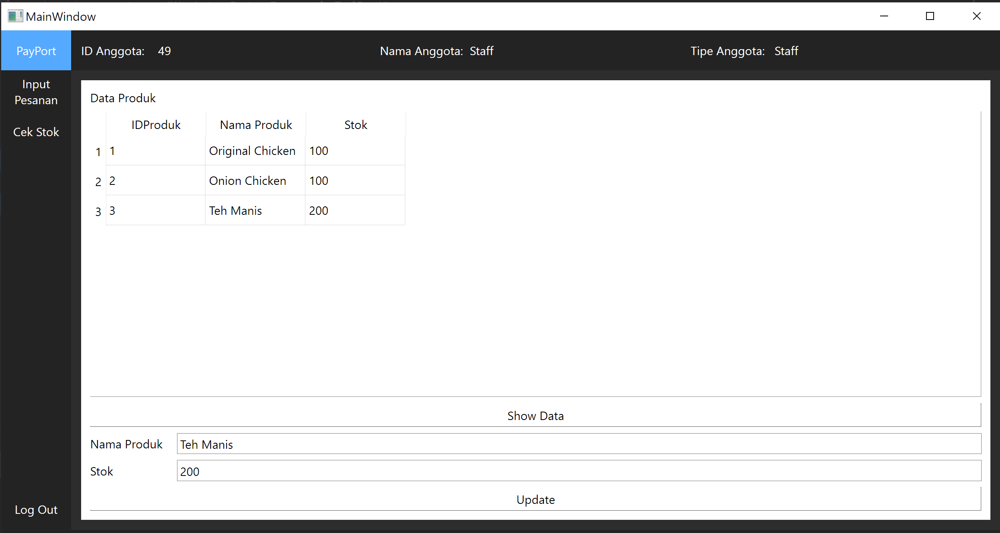
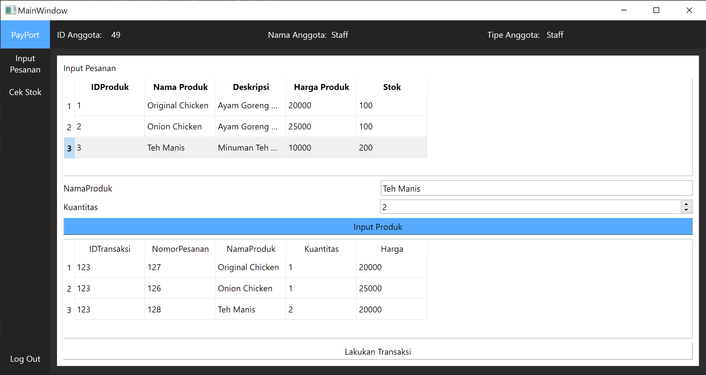
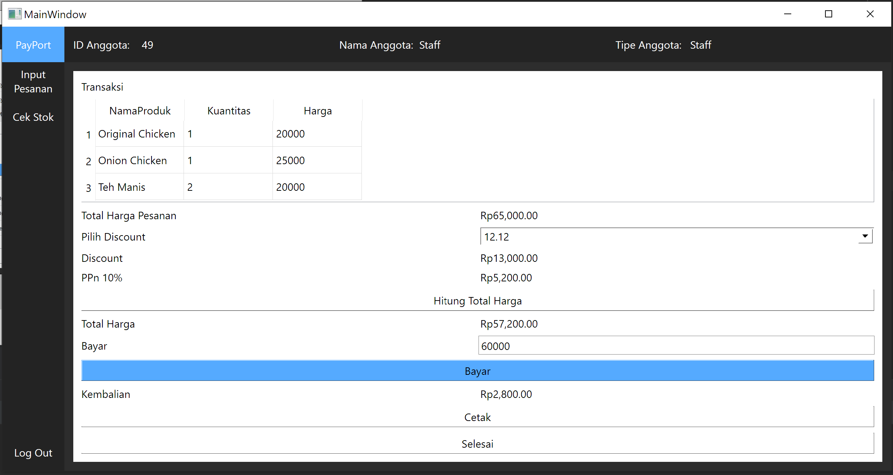

# Payport

## Deskripsi Aplikasi
Aplikasi ini mempunyai 2 pihak eksternal yaitu owner dan staff. Aplikasi ini memiliki 2 jenis tampilan yang dibedakan berdasarkan proses login usernya, yaitu tampilan untuk owner dan tampilan untuk pegawai. Tampilan pada owner meliputi melihat laporan penjualan harian dan laporan penjualan bulanan, sedangkan tampilan pada pegawai meliputi memasukkan jumlah stok, menginput pesanan, dan melakukan transaksi.

Pada permulaan Owner dapat memasukkan sejumlah data awal seperti saldo, akun yang digunakan, harga, produk, dan program promosi ke dalam basis data. Kemudian Staff akan menggunakannya untuk memasukkan pesanan, dan jumlah stok per hari ke sistem dan sistem dapat memberi tahu staff mengenai sisa stock, total harga, dan besar kembalian yang perlu dibayarkan kepada customer. Pada akhir hari sistem dapat memberikan hasil kalkulasi dari setiap transaksi yang dilakukan oleh sistem berupa laporan penjualan kepada Owner.

## Cara Menjalankan Aplikasi
Berikut merupakan instruksi untuk menjalankan aplikasi

### A.
1. Download [XAMPP](https://www.apachefriends.org/download.html)
2. Run Apache dan MySql di XAMPP
3. Buka phpMyAdmin
4. Import database payport
5. Download Artifacts MSDeploy (Di Payport Repository)
6. Buka folder src/dist
7. Jalankan main.exe

### B.
1. Ikuti langkah 1-4 pada cara A
2. Download Zip Repository PayPort
3. Buka folder payport
4. Run terminal, start virtual environment
5. Install requirement.txt
```bash
pip install -r requirement.txt
```
6. Jalankan main 
```python
python main.py
```

## Daftar Modul yang Diimplementasikan
Berikut merupakan daftar modul yang kami implementasikan beserta Informasi Penanggung Jawabnya dan tampilan layar modul tersebut dengan *screen capture* layar modul

### Login


### Laporan Harian


### Laporan Bulanan


### Edit Anggota


### Edit Produk


### Edit Promosi


### Cek Stok


### Input Pesanan


### Transaksi


## Daftar Tabel Basis Data
Berikut merupakan daftar tabel basis data yang diimplementasi dan dilengkapi dengan nama tabel beserta atribut dan deskripsinya

### Tabel Anggota

|   Id Field  	| Deskripsi                   	| Tipe & length 	|
|:-----------:	|-----------------------------	|:-------------:	|
| IDAnggota   	| Primary Key                 	| Integer(11)   	|
| NamaAnggota 	| Nama dari Anggota           	| Varchar(50)   	|
| TipeAnggota 	| Tipe berupa Owner dan Staff 	| Varchar(10)   	|
| Username    	| Nama untuk Login            	| Varchar(10)   	|
| Password    	| Password untuk Login        	| Varchar(8)    	|

### Tabel Transaksi

|   Id Field  	| Deskripsi                   	| Tipe & length 	|
|:-----------:	|-----------------------------	|:-------------:	|
| IDTransaksi 	| Primary Key                 	| Integer(11)   	|
| IDAnggota   	| ID dari tabel Anggota       	| Integer(11)   	|
| IDPromosi   	| ID dari tabel Promosi       	| Integer(11)   	|
| Tanggal     	| Tanggal transaksi           	| date          	|
| TotalHarga  	| Total harga yang dibayarkan 	| Integer(11)   	|

### Tabel Pesanan

|   Id Field   	| Deskripsi             	| Tipe & length 	|
|:------------:	|-----------------------	|:-------------:	|
| IDTransaksi  	| Primary Key           	| Integer(11)   	|
| NomorPesanan 	| Primary Key           	| Integer(11)   	|
| IDProduk     	| ID dari tabel Promosi 	| Integer(11)   	|
| Kuantitas    	| Kuantitas Produk      	| Integer(11)   	|
| TotalHarga   	| Total harga Pesanan   	| Integer(11)   	|

### Tabel Produk

|   Id Field  	| Deskripsi           	| Tipe & length 	|
|:-----------:	|---------------------	|:-------------:	|
| IDProduk    	| Primary Key         	| Integer(11)   	|
| NamaProduk  	| Nama produk         	| Varchar(50)   	|
| Deskripsi   	| Deskripsi produk    	| Varchar(100)  	|
| HargaProduk 	| Harga satuan produk 	| Integer(11)   	|
| Stok        	| Total stok          	| Integer(11)   	|

### Tabel Promosi

|    Id Field   	| Deskripsi                      	| Tipe & length 	|
|:-------------:	|--------------------------------	|:-------------:	|
| IDPromosi     	| Primary Key                    	| Integer(11)   	|
| NamaPromosi   	| Nama promosi                   	| Varchar(20)   	|
| JumlahPromosi 	| Jumlah Promosi yang ditentukan 	| Float         	|
